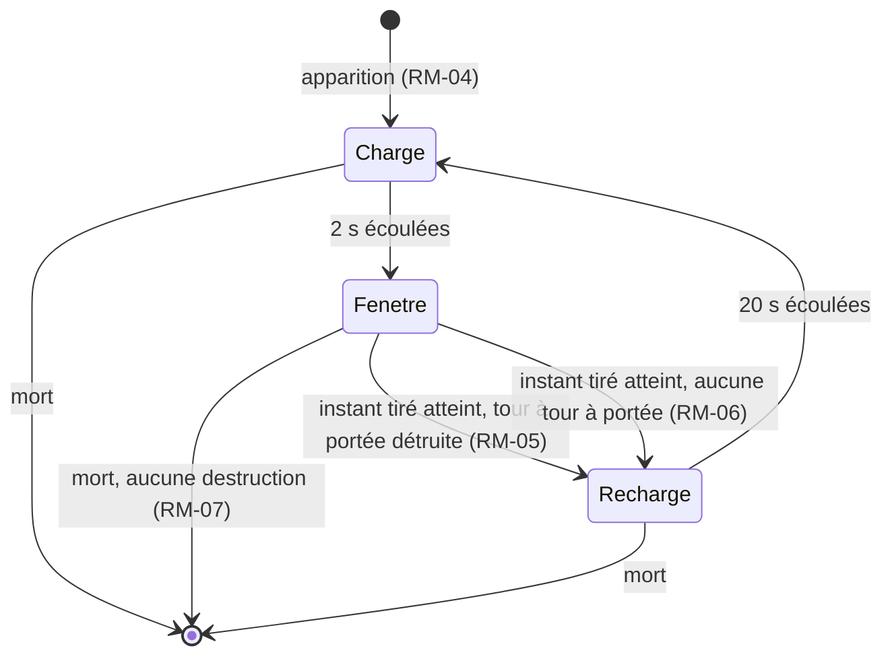

# Créatures et vagues

> Cinq nouvelles créatures à capacité (dont une qui casse des tours), des vagues qui mélangent plusieurs créatures et des chefs dotés d'une vraie mécanique. Pour le joueur qui a résolu la campagne avec une seule recette : chaque vague doit l'obliger à varier ses tours et à surveiller son labyrinthe.

## 1. Contexte

Chaque vague n'aligne aujourd'hui qu'une seule créature (`src/domain/catalog/creeps.ts:23`), donc un contre fixe suffit. Les seules capacités sont la régénération, le vol et l'immunité magique ; les chefs ne sont que de gros sacs de PV. Le labyrinthe, une fois construit, n'est jamais menacé.

## 2. Vocabulaire

| Terme | Définition |
|---|---|
| Groupe | Partie d'une vague : une créature, un nombre, un intervalle entre apparitions, un délai de départ depuis le début de la vague. |
| Vague mixte | Vague d'au moins deux groupes. |
| Briseur | Créature qui détruit périodiquement la tour la plus proche. |
| Charge / fenêtre / recharge | Les trois temps du cycle d'un briseur (RM-04). |
| Bouclier | Réserve de coups annulés avant que les dégâts ne passent. |
| Tour | Toute construction, mur de pierre compris. |

## 3. Vue d'ensemble

## 4. Cas d'usage

### CU-01 — Affronter une vague mixte
**Acteur** joueur · **Intention** contenir une vague où plusieurs créatures arrivent en même temps.
**Scénario nominal :**
1. Le joueur consulte l'aperçu de la prochaine vague : il liste chaque groupe (créature, nombre).
2. La vague commence : chaque groupe démarre après son propre délai et fait apparaître ses créatures à son intervalle.
3. La vague est terminée quand toutes les créatures de tous les groupes, rejetons compris (RM-11), sont mortes ou sorties ; la prime de fin de vague et les intérêts sont versés une seule fois.

### CU-02 — Perdre une tour face à un briseur
**Acteur** joueur · **Intention** protéger son labyrinthe d'un Sapeur gobelin.
**Scénario nominal :**
1. Un Sapeur apparaît et entre en charge pendant 2 s.
2. Chargé, il est signalé visuellement ; un instant est tiré au hasard dans sa fenêtre de 10 s.
3. À cet instant, la tour la plus proche à 3 cases ou moins est détruite, sans remboursement.
4. Le trajet des créatures est recalculé : le passage s'ouvre là où était la tour.
5. Le Sapeur se recharge 20 s, puis recommence.
**Variantes :** le joueur tue le Sapeur pendant sa charge ou sa fenêtre, et rien n'est détruit. Il place des murs de pierre en bord de couloir pour qu'ils soient les tours les plus proches.

### CU-03 — Tuer une créature à capacité
**Acteur** joueur · **Intention** adapter ses tours et son ciblage aux capacités.
**Scénario nominal :** selon la créature, le joueur tue d'abord le Chaman, frappe à la chaîne ou en zone contre les Limons et leurs rejetons, use le bouclier des Gardes runiques avec des tirs rapides, ou place ses ralentissements là où les Coureurs sprintent.

### CU-04 — Vaincre un chef
**Acteur** joueur · **Intention** survivre aux vagues 10, 20 et 30.
**Scénario nominal :** l'Ogre accélère sous 50 % de PV. L'Hydre fait naître des têtes à 75, 50 et 25 % de PV. Le Seigneur des cendres casse des tours, escorté de Chamans.

## 5. Règles métier

### RM-01 — Vague composée de groupes
- **Énoncé** : une vague contient un ou plusieurs groupes. Chaque groupe fait apparaître son nombre de créatures, la première au bout de son délai de départ, puis une à chaque intervalle. · **Origine** : choix de design · **Concerne** : CU-01

### RM-02 — Fin de vague unique
- **Énoncé** : la prime de fin de vague et les intérêts sont versés une seule fois par vague, quand plus aucune de ses créatures (rejetons compris) n'est en jeu ni à venir. · **Origine** : comportement existant étendu · **Concerne** : CU-01

### RM-03 — Aperçu par groupe
- **Énoncé** : l'aperçu de la prochaine vague affiche chaque groupe (créature et nombre). Une vague de chef affiche le chef en premier. · **Origine** : comportement existant étendu · **Concerne** : CU-01

### RM-04 — Cycle du briseur
- **Énoncé** : à son apparition, le briseur entre en charge. Charge écoulée : il ouvre une fenêtre et un instant y est tiré au hasard. À cet instant, il tente une destruction puis passe en recharge. Recharge écoulée : nouvelle charge. Un briseur gelé voit son cycle suspendu. · **Origine** : choix de design · **Concerne** : CU-02, CU-04

### RM-05 — Destruction d'une tour
- **Énoncé** : la tour détruite est celle dont une case est la plus proche du briseur, à une portée au plus égale à la sienne ; les murs de pierre comptent. En cas d'égalité, le hasard tranche. La tour disparaît, le joueur ne récupère **aucun** or et le trajet est recalculé aussitôt, y compris pour les créatures déjà en route. · **Origine** : choix de design · **Concerne** : CU-02
- **Exemple conforme** : un mur à 1 case et un Canon à 2 cases : le mur est détruit.

### RM-06 — Aucune tour à portée
- **Énoncé** : si aucune tour n'est à portée à l'instant tiré, rien n'est détruit et le briseur passe quand même en recharge. · **Origine** : choix de design · **Concerne** : CU-02

### RM-07 — Mort du briseur
- **Énoncé** : un briseur mort avant l'instant tiré ne détruit rien. · **Origine** : choix de design · **Concerne** : CU-02

### RM-08 — Briseur chargé visible
- **Énoncé** : pendant sa fenêtre, un briseur est visuellement distinct d'un briseur en charge ou en recharge. · **Origine** : choix de design (lisibilité) · **Concerne** : CU-02

### RM-09 — Soin du Chaman
- **Énoncé** : toutes les 3 s, un Chaman rend à chaque autre créature vivante à 2,5 cases ou moins 25 % des PV max **du Chaman**, sans dépasser leurs PV max. Il ne se soigne pas lui-même. · **Origine** : choix de design · **Concerne** : CU-03, CU-04

### RM-10 — Bouclier
- **Énoncé** : chaque coup reçu (impact de projectile, rebond de chaîne, éclat de zone) consomme une charge de bouclier et n'inflige aucun dégât ni effet tant qu'il reste des charges. Les dégâts du poison déjà appliqué ne sont pas bloqués et ne consomment pas de charge. · **Origine** : choix de design · **Concerne** : CU-03

### RM-11 — Scission
- **Énoncé** : un Limon tué (pas sorti) fait apparaître 2 petits Limons à sa position. Ils poursuivent le même trajet, comptent dans la vague et ne se divisent pas. Chacun rapporte sa propre prime. · **Origine** : choix de design · **Concerne** : CU-01, CU-03

### RM-12 — Sprint
- **Énoncé** : touché alors que son sprint est disponible, le Coureur double sa vitesse pendant 1 s, puis le sprint se recharge pendant 4 s. Le ralentissement s'applique à la vitesse doublée ; gelé, il reste immobile. · **Origine** : choix de design · **Concerne** : CU-03

### RM-13 — Fureur de l'Ogre
- **Énoncé** : sous 50 % de ses PV max, l'Ogre avance 1,5 fois plus vite. S'il repasse au-dessus, il reprend sa vitesse normale. · **Origine** : choix de design · **Concerne** : CU-04

### RM-14 — Têtes de l'Hydre
- **Énoncé** : chaque fois que l'Hydre passe sous 75, 50 puis 25 % de ses PV max, 2 têtes naissent à sa position, au plus une fois par seuil (6 têtes au total), même si elle se régénère au-dessus puis repasse le seuil. Les têtes comptent dans la vague. · **Origine** : choix de design · **Concerne** : CU-04

### RM-15 — Seigneur des cendres briseur
- **Énoncé** : le Seigneur des cendres suit RM-04 à RM-08 avec ses propres durées et sa propre portée (§ 6). · **Origine** : choix de design · **Concerne** : CU-04

### RM-16 — Déterminisme
- **Énoncé** : tous les tirages (instant de destruction, égalité entre tours) passent par le hasard de la partie. Même graine et mêmes ordres donnent les mêmes destructions. · **Origine** : comportement existant · **Concerne** : transverse

### RM-17 — Équilibrage
- **Énoncé** : avec la nouvelle campagne, le bot d'équilibrage gagne toujours en Recrue et gagne en Vétéran avec au plus une dizaine de vies perdues. · **Origine** : comportement existant · **Concerne** : transverse

## 6. Chiffres

PV = multiplicateur des PV de base de la vague ; prime = multiplicateur de la prime de base.

| Créature | PV | Vitesse | Armure | Prime | Fuite | Capacité |
|---|---|---|---|---|---|---|
| Sapeur gobelin | 1,1 | 1,8 | Moyenne 2 | 1,4 | 1 | Briseur : charge 2 s, fenêtre 10 s, recharge 20 s, portée 3 cases |
| Chaman | 0,9 | 2,0 | Légère 1 | 1,2 | 1 | Soin 25 % de ses PV max, rayon 2,5 cases, toutes les 3 s |
| Limon | 1,2 | 1,8 | Sans armure 0 | 1,0 | 1 | Scission en 2 petits Limons |
| Petit Limon | 0,35 | 2,4 | Sans armure 0 | 0,3 | 1 | — |
| Garde runique | 1,0 | 1,9 | Lourde 3 | 1,2 | 1 | Bouclier de 4 coups |
| Coureur des dunes | 0,7 | 2,4 | Légère 0 | 1,0 | 1 | Sprint ×2 pendant 1 s, recharge 4 s |
| Tête d'Hydre | 1,5 | 2,0 | Moyenne 3 | 0,5 | 1 | — |
| Ogre (existant) | — | — | — | — | — | Fureur ×1,5 sous 50 % de PV |
| Seigneur des cendres (existant) | — | — | — | — | — | Briseur : charge 2 s, fenêtre 5 s, recharge 12 s, portée 4 cases |

Toutes les nouvelles créatures sont terrestres.

Campagne : les vagues 1 à 5 sont inchangées. Chaque nouvelle créature paraît d'abord seule, puis dans des mélanges. Les intervalles et délais de départ se règlent à l'équilibrage (RM-17).

| Vague | Groupes | Vague | Groupes |
|---|---|---|---|
| 6 | Coureur 14 | 19 | Garde 14 + Limon 10 |
| 7 | Colosse 10 | 20 | Hydre 1 |
| 8 | Troll 12 + Loup 10 | 21 | Golem 16 + Sapeur 4 |
| 9 | Spectre 12 | 22 | Vouivre 16 + Spectre 12 |
| 10 | Ogre 1 + Maraudeur 6 | 23 | Colosse 16 + Garde 10 |
| 11 | Garde 14 | 24 | Limon 16 + Chaman 5 |
| 12 | Vouivre 12 + Maraudeur 12 | 25 | Troll 20 + Sapeur 6 |
| 13 | Limon 12 | 26 | Coureur 26 + Loup 20 |
| 14 | Rat 30 + Chaman 4 | 27 | Harpie 22 + Vouivre 10 |
| 15 | Spectre 14 + Golem 8 | 28 | Golem 18 + Chaman 6 + Sapeur 4 |
| 16 | Sapeur 8 | 29 | Colosse 20 + Garde 12 + Coureur 12 |
| 17 | Colosse 14 + Chaman 5 | 30 | Seigneur des cendres 1 + Chaman 4 |
| 18 | Harpie 18 + Coureur 14 | | |

## 7. Hors périmètre

| Exclusion | Raison |
|---|---|
| Réparer ou reconstruire automatiquement une tour détruite | Choix de design : destruction définitive. |
| Mode infini à modificateurs, nouvelles cartes, bilan de partie | Specs séparées (`mode-infini`, `nouvelles-cartes`, `bilan-de-partie`). |
| Créatures volantes à capacité | Version minimale : les capacités sont testées au sol d'abord. |

## 8. Hypothèses

| # | Hypothèse | À valider par |
|---|---|---|
| H1 | Le mode infini continue de reprendre les vagues 11 à 30, désormais mixtes. | spec `mode-infini` |
| H2 | Un chef ne peut pas être gelé (comportement existant), donc le cycle du Seigneur n'est jamais suspendu par le gel. | lecture de `src/domain/systems/status.ts:35` |
